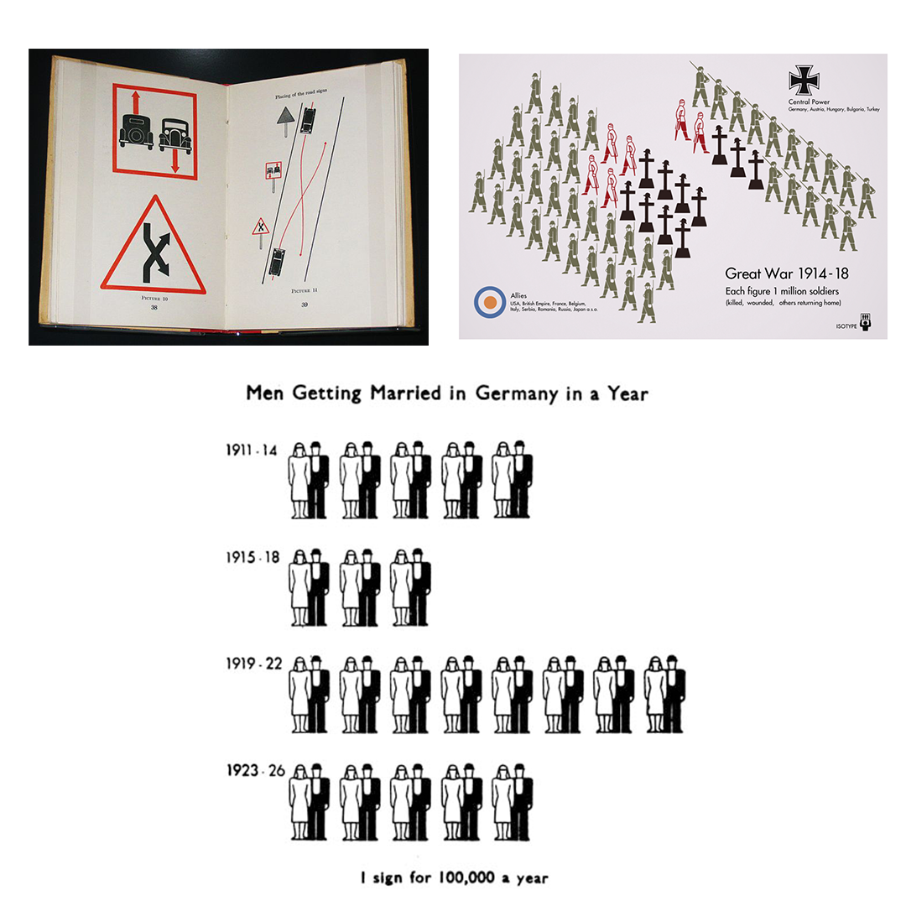
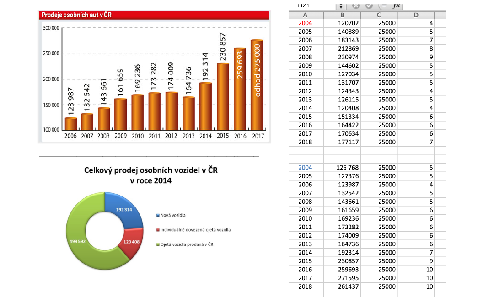
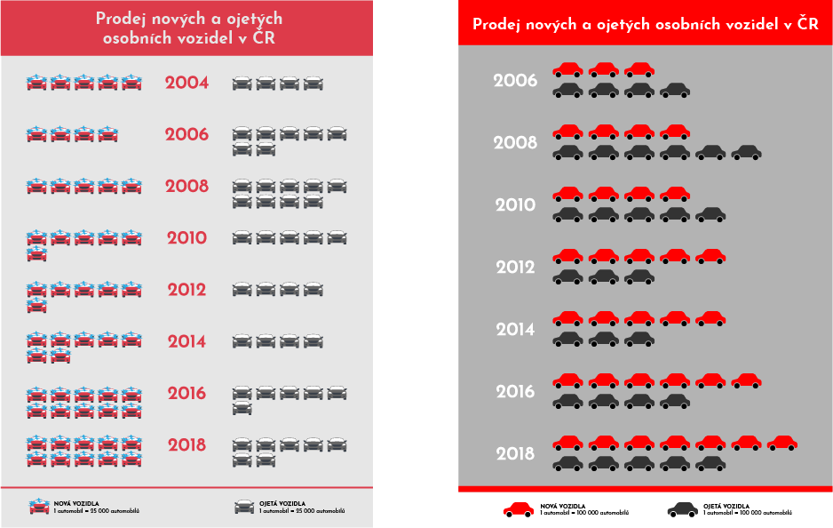
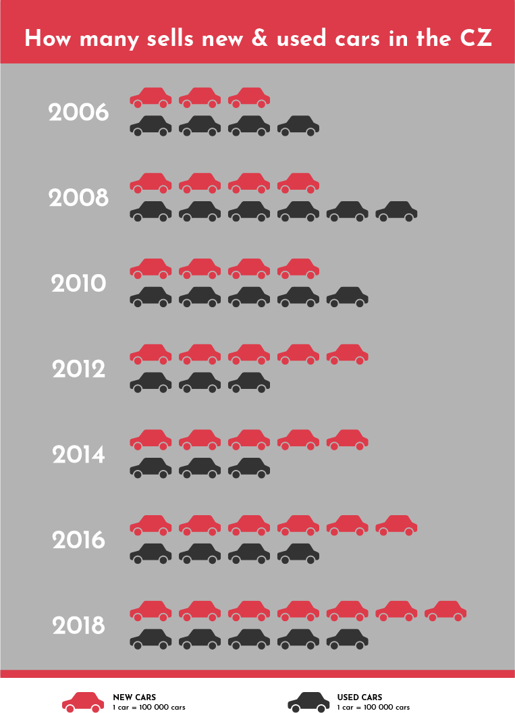

###### Case study
# CARS ARE EVERYWHERE AND THERE’S A LOT OF THEM!

The project started when I was doing homework to typography at school. We had to do a poster about information graphic, in the isotype style. 

#### What is ISOTYPE? What does it mean?
Isotype (International System of Typographic Picture Education) is a method of showing social, technological, biological, and historical connections in pictorial form. It consists of a set of standardized and abstracted pictorial symbols to represent social-scientific data with specific guidelines on how to combine identical figures using serial repetition. Professional definition. 

Simply, it is a pictorial language that everyone understands, no matter where we come from or what we do.

##### Example of Isotypes posters. 

When I knew what is Isotype. Next step was what topic will I do. The main idea of the project, I got it, when I was in a traffic jam. I asked myself. „Why doing again to me? „ „Where are all the cars going?“  „Why there are so many cars? „  After this, I got an idea. My topic of ISOTYPE poster will be about How many sells new and used automobiles in the Czech Republic. 

So, the next step on this work was a detailed analysis and research about How many sells new and used cars in the Czech Republic. 
It was most difficult because it was a lack of information about them. 
I searched for information for one week from the internet, of many different sources of information.
##### Example of sources.

The main idea of a poster shows a difference between how many sell used cars and new cars last year and a few years ago. The total number of cars sold in total in recent years. What was the economic situation in the past years of the Czech Republic? How many cars, will be added per year? And we need it so many cars? 

When I had a complete a prepare information. I stared a designed a poster. I tried many options. But only one was perfect. 

##### Sample poster versions.

## THE FINAL RESULT

---
