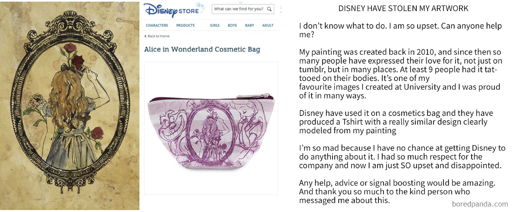
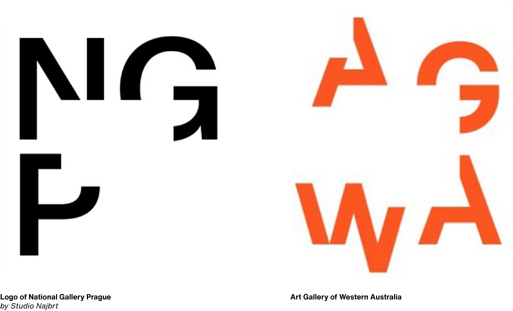

##### Chapter IV. #####
# COPYING - IS IT GOOD OR NOT? 
# IT DEPENDS ON THE ANGLE OF VIEW. #

Everyone is copying. We are inspired by things around us. With things that someone else invented. We do not do it intentionally, we do it automatically and subconsciously. We start copying in our childhood when we imitate our parents. We copy how they speak and behave. We want to be like them and they are the first people who we look up to like idols. Copying is learning.

We are copying because we want to be better, develop and try new things. Maybe we are tying to emulate our idols. For instance, when Vincent Van Gogh, studied the techniques mastered by Japanese artists, he copied prints by Keisei Eisen and Utagawa Hiroshige. He tried to replicate their bold lines, their energetic compositions, and their strong colours.

When I was a child, I didnť like copying or when anyone was copying from each other, like  monkeying (Czech expression), because I thought it was a bad thing. Those others were laughing at me. But now, when I am older and smarter, I found out that we copy for personal reasons, such as exploring the work of our idols. In graphic design, it is an important method to help us improve our skills.

I started copying when I first started to learn how to draw and paint. I remember how I was drawing illustrated characters from my favourite fairytales with my grandmother. The cartoons I copied the most were by Josef Lada. He was and still is my favourite artist. Josef Lada was a Czech painter, illustrator, cartoonist, writer and stage designer. He was a pioneer of the Czech comic book tradition and founder of the “Czech modern fairytale” genre. He also created the legendary Mikes character. At elementary school I enjoyed copying his style in art lessons when we had the task to draw half of the painting by Josef Lada. I liked his style and his illustrations. I wanted to be like him at least in part. I still copy his drawings today, and I like to remember my childhood times. Already when I was in elementary school. I enjoyed copying his characteristic style on art class when we had the task to draw half of the painting by Josef Lada. I like his style and his illustrations. I wanted to be like him at least in part. 
I still copy his drawings today, and I like to remember my childhood times.

### WHEN IS COPYING IS BAD? ###
On the other hand, my opinion is that copying is a bad thing when we shamelessly steal something from someone and consider it our work or masterpiece.
Once we do that, we should admit what our inspiration was. It is a shame when we do not admit it and pretend it is our work. People will figure it out anyway. They are not stupid and only you will look like an idiot. For example, when Disney stolen artwork by Katie Woodger.

### SOMETIMES COPYING IS A COINCIDENCE ###
But sometimes, it is possible that we have the same idea as somebody from the other side of the world. In this case, it is not copying, it is a coincidence. This happened with the design for the logo of the National Gallery by Studio Najbrt. The logo, by designer Aleš Najbrt, is based on the three letters of NGP with a rectangle omitted between them. The Art Gallery of Western Australia in Perth has a logo with a similar principle.

### ME AND COPYING ###
Now I am copying because I want to try and learn new styles, directions and elements of graphic design. For example, when I attended a Pavel Fuksa workshop last year, we had to design an original postage stamp. He had a pack of cards with the names of countries on them.We each took a card and that was our country. I got Georgia. Then, he gave us a subject that he selected randomly from Wikipedia. Mine was the Brotherhood of Parish congregation of the Evangelical Church of Czech Brethren in Benešov, which is located in Benešov. (In the Czech Republic) Our challenge was to design a postage stamp for our country with the theme from Wikipedia. So, I had to design a stamp for Georgia featuring the Parish congregation of the Evangelical Church of Czech Brethren in Benešov.

**Finally**, I would say that copying has a purpose when we create new things or we keep improving an idea and give it a new direction. It is good because we make a new idea and things.
If we do not copy, the world and design would stop.

### As Demetri Martin once said, *"The earth without art is just eh."* ###

