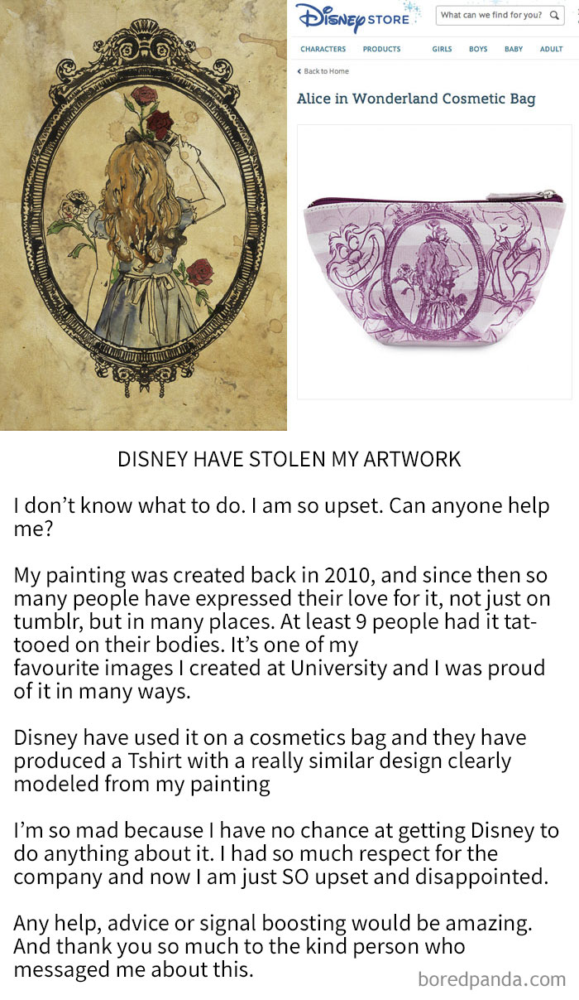

##### Chapter IV. #####
# IS IT GOOD OR NOT? IT DEPENDS ON THE ANGLE OF VIEW. #

Everyone copying. We are inspiring with things around us. With things, which their someone else inventing. We do not do it intentionally, because it is automatically from our subconscious. Because since our childhood we are copying. When we imitate our parents in behaviour and how we speak and we want to be like, to someone we are looking up to our idol. 

We are copying because we want to be better, develop, trying new things. And will be in part like our idol. For instance, like a Vincent Van Gogh, when he painted like and studied the techniques mastered by Japanese artists, he copied prints by Keisei Eisen and Utagawa Hiroshige. He tried to replicate their bold lines, their energetic compositions, and their strong colours. 

Picture A Vincent Van Gogh

When I was a child, I didnť like copying or when anyone was copping from each other, like a monkeying (Czech expression), because I thought it is a bad thing. Those others will laugh at me. But now, when I am older and smarter. I found out that these days, we are copying for personal reasons. Reasons are, we want to be like our idol, for example in graphic design or getting better in things, which we cannot and we look for how we learn it. 

Probably, when I started copying it was when I began learning how drawing and painting. I remember how I was drawing illustrated characters from my favourite fairytales with my grandmother. The most copying cartoon characters were from Josef Lada. He was and still my favourite artist. 
Josef Lada was a Czech painter, illustrator, cartoonist, writer and stage designer. He was a pioneer of the Czech comic book tradition and founder of the “Czech modern fairytale” genre.
Author of the legendary Mikes character.  

Already when I was in elementary school. I enjoyed copying his characteristic style on art class when we had the task to draw half of the painting by Josef Lada. I like his style and his illustrations. I wanted to be like him at least in part. 
I still copy his drawings today, and I like to remember my childhood times.

### WHEN IS COPYING IS BAD? ###
On the other hand, my opinion is that copying is a bad thing when we steal something from someone and we consider it our work or masterpiece and She is not ashamed of it.
Once we do that, we should admit what our inspiration was, it is not a shame. It is a shame when we do not admit it and pretend it is our work. The others will figure it out anyway, they are not stupid and only you will be an idiot. For example, when Art By Katie Woodger Stolen By Disney.

### SOMETIMES COPYING IS A COINCIDENCE ###
But sometimes are possible that we have the same idea as somebody from the other side of the world. At this case, it is not copying but is a coincidence. 
Like it happened at the logo of the National Gallery by Studio Najbrt. The logo by designer Aleš Najbrt is created on three letters of NGP and a rectangle omitted between them. A similar principle has at the logos of the Art Gallery of Western Australia in Perth. 

PICTURE OF N. GALLERY.

### ME AND COPYING ###
Now I am copying because I want it to try and learn new styles, directions and things in the graphic design. For example, when I was on the workshop by Pavel Fuksa last year at university. On the workshop, we made an original post stamp. He had a pack of cards with the names of countries on them.
We each took a card and that was our country. I got Georgia. Then, he gave us a subject that he selected randomly from Wikipedia. Mine was the Brotherhood of Parish congregation of the Evangelical Church of Czech Brethren in Benešov, who is located in Benesov. (In the Czech Republic) Our challenge was to design a postage stamp for our country with the theme from Wikipedia. So, I had to design a stamp for Georgia featuring the Parish congregation of the Evangelical Church of Czech Brethren in Benešov.

PICTURE OF MY POST STAMP.

**Finally**, I say that copying has a purpose when we create new things, which we keep improving the idea and we give it a new direction. It is good because we make a new idea and things. 
If we still are not copying, the world and design would stop. 

As Demetri Martin once said, *"The earth without art is just eh."*

