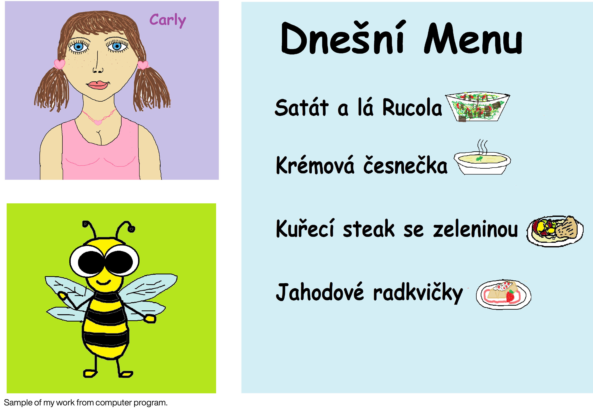

# HOW I GET INTO GRAPHIC DESIGN.
Today, I will show you a presentation about How did I get into Graphic design or I begun with Graphic design.
In the beginning, I will talk about Who am I? 

## WHO I AM?
Hi. My name is Anezka Janeckova. I am a 22 years old woman from Prague, I like art, cars, dogs, cats, music and delicious food since my childhood. Often I am very moody and when something I don't like, I am able to say my opinion. This I have after my dad.

## WHERE AND WHEN BEGUN MY JOURNEY? 
My story has the three most important chapters. There are:
+ Elementary school
+ High school
+ University

## Elementary school
When I was a child, I very liked art and drawing and painting. 

 It very looks like, when Optimus prime, from transformers, has a hangover. And the dog doesn't look like a dog, just like a deer. 

Also, I liked to take photos from holidays and trips. Because my grandfather liked to take photos to. And sometimes, we took photos together. 
My best photo, when I made it in childhood, is a photo of my younger brother Thomas. 

Also, I visited an art lesson on Elementary Art School South City for five years.
I enjoyed it because I learned new things. Making ceramics. Creating lithography. Painting with watercolours and drawing with pastels. It was my favourite technic in art.

I liked a drawing at school in art lessons. It was my favourite subject at school. When I was in 4th grade, we had a bad teacher at the art lesson, didn't like her and she didn't like me. But she very loved it my works when We had the task to draw half of the painting. And I chose artwork by Josef Lada. Because he was my childhood idol in art. I enjoyed that. 

When I was twelve years old, one day my dad brought home a graphic tablet. I had to try it. So I started drawing in a computer program "Malování" by Microsoft with this tablet. And this was maybe the first sign of my beginnings in Graphic design.

Also, for all my works, I used my favourite font in my childhood Comic Sans.

### "Everyone has to begin somewhere."

When I was older, I made posters for school events. Example for Halloween, Chrismas's parties and others.

Last year at elementary school, I remember, when I thought about where I will go to high school. My favourite teacher on Czech language subject asked me: "Where you want to go to high school." And I answered her: "I don't know, I probably go to the gymnasium or something like that. Why?" And she told me: **"It would be a mistake, you should try to go to an art school. You must think about it."**
So, I tried it. I chose a MICHAEL - High School and College advertising and artistic creation in Prague. Field: Graphic design. I went on the entrance examination at this school. I remember, we created a three task. And we had an interview. On the interview, they asked me: "Why you want to study this school?" And I answered:" Because this school has a field what I want to study and this school is very near to my home." They looked at me like: Are you serious? And answered me: "Is very interesting, but you take it very local."
So, I did it. I went this high school.

## High School
The High School pointed out, what it is a graphic design, showed me a new direction of art. I painted according to still lifes. 
I learned to work with Adobe programs.  I grew up. I started it, more interest in graphic design. 
 

I found new idols and artists, for example, Andy Warhol and his pop art style. Also now, I like copying his style. František Štrorm in typography. Pavel Fuksa, And other designers. 

Last work at school, it was my poster for Graduation. The topic was a destiny eight, this topic about Czech - Slovakia history, during the second world war.

After this, I want to go to university. I wanted to study graphic design and advertising. But a lot of University in Prague, you can't study graphic design and advertising in the same field. So, I go to the University of Creative Communication in Prague. Field: Graphic and Media Design.

## University 
The University showed new experiences of Graphic and Media Design. I learned new skills in design. For example the book rate, whole idea and concept for projects. When an artwork, have an idea, it is more important that a how is artwork look like.  I learned to be more confident with my works. I found new interesting designers. And others.

### And this is my whole story about How did I get into Graphic and media design.

