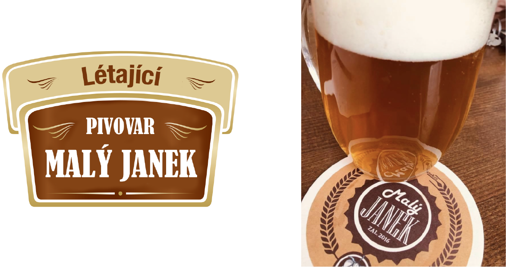
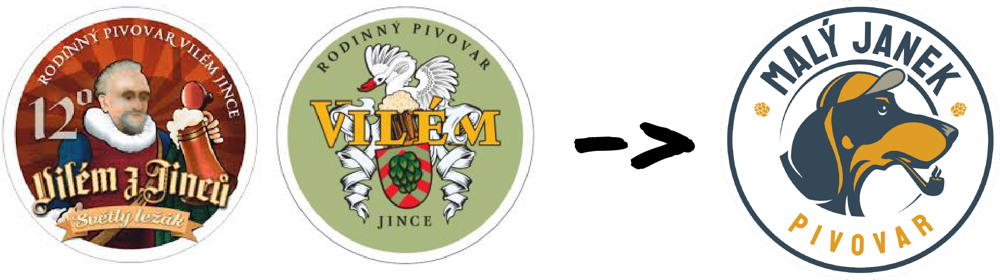
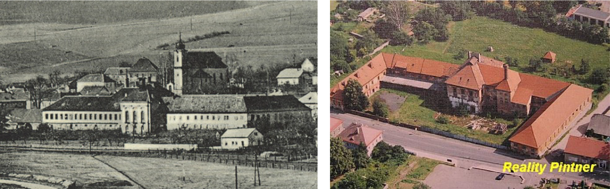
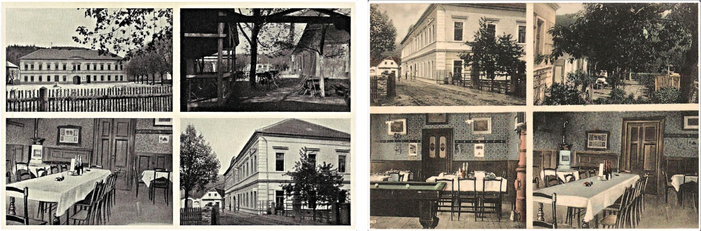
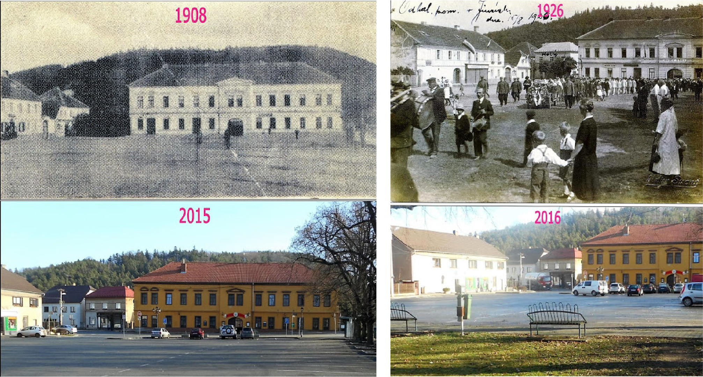
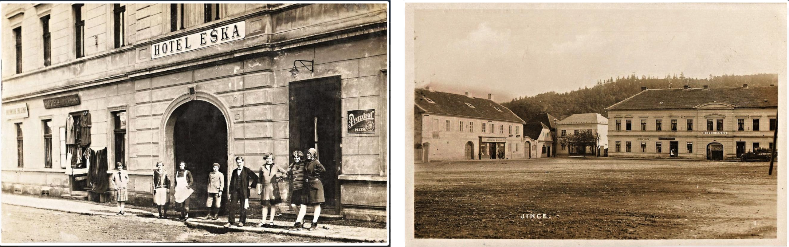
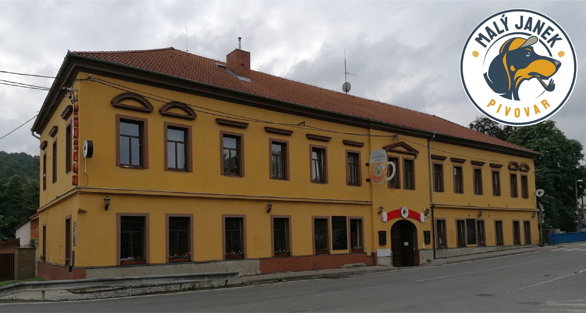

# BREWERY MALÝ JANEK IN JINCE #
My bachelor's thesis is about rebranding the existing brand for a gastro client who is Malý Janek (Small Janek) brewery in Jince.
Firstly I will describe our history of the brand Malý Janek and Where it all journey began. 

### How it all started? ###
In 2016, (When I was a first grande at High School) when my father saw a restaurant (before a Greek restaurant) for rent in Prague. And he got an idea. Founded a new business. Brasserie. When you found 20 beer specials from Czech breweries for example Malěšov, Muflon z Kunratic, Matuška, Cvikov... and Czech and pub cuisine. Also, I went to help with some work. For example, I Washed the dishes, spread food,  poured a beer and also designed a Daily menu or something else. Some posters for the event.

##### *Me with my sister & Dad / Me & Dad* #####

After years, when my dad wanted to brew an own beer. So he founded a beer brand, Létající pivovar Malý Janek. A gipsy brewery. It means when you have your beer brand which you own and you don't have an own brewery, where the beer would be made. 
Gypsy, or nomad, brewing usually falls under the category of contract brewing. Gipsy breweries generally do not have their equipment or premises. They operate on a temporary or itinerant basis out of the facilities of another brewery, generally making "one-off" special occasion beers. Our beer was started to be produced and supplied to us by the Cvikov brewery.

In the year 2019, my dad bought a brewery Vilém from Jince. And he started work at this brewery. and he founded the brand Malý Janek brewery from Jinec. And in March 2020 the brewery opened like Malý Janek brewery from Jinec. 

## History about Brewery from Jinec ##
The Podbrdský town of Jince was first mentioned in the sources as early as the middle of the 14th century when it was a royal fiefdom.
From the beginning of the 16th century. the village was owned by the Zeman family of the Pešík family from Komárov, during which an unspecified brewery with a malt house and its hop garden was established in Jince. After the Thirty Years' War, Václav Vratislav from Mitrovice bought the indebted goods of the Malovce family from Chýnov.

In connection with the sale in 1648, the brewery is located again, located opposite the Jinec fortress, which in the middle of the 14th century. owned by Bořita Bořitovec from Jinec. Under the lords of Mitrovice, the original Gothic and later partially renaissance fortress was rebuilt into a representative chateau. The manorial brewery, which was expanded at the same time, also changed.

In 1772, the second brewery building was built at the mill drive. Brewery cellars from the original brewery continued to be used. From the end of the 18th century. the brewery was leased to Jinka brewers.

In 1806, Jince Rudolf of Vrbno and Bruntál bought it and annexed it to the Hořovice estate. Even though Vrbnová held a larger brewery in Hořovice, the Jinka brewery remained in operation. He had sufficient consumption, which was taken care of by the surrounding ironworks and mills. The combination of both goods harmed the manor house, which was not inhabited by the owner, and turned into a warehouse for the local ironworks and flats of the metallurgical administration.

In 1852, the manor of Hessen, Friedrich Vilém I, took over the manor. In 1883, the brewery was leased by Antonín Šilinger, a brewer from neighbouring Lochovice, under whose influence the level and production of beer increased rapidly. The subsequent modernization carried out by Antonín Šilinger mainly affected the brewery and increased its content to 40 hl. A new forest was built at the malting plant and the old brewery became a barn serving as a warehouse. Towards the end of the 19th century. reached annual beer exhibitions of more than 10,000 hl per year.
After the untimely death of Antonín Šilinger, several breweries took turns in the brewery, and before the First World War, the annual exhibitions reached about 14,000 hl.

During the war, there was a significant decline, but already in 1921, the brewery was bought from Jindřich Hanau-Schaumburg by Šilinger's son Jaroslav. He used the knowledge gained from studies in the field and previous practice and equipped the brewery with the latest technologies. This created a small but modernly conceived and technically highly valued company.
During World War II, Jince was already part of the military area used by the German army. Its members became important customers of the local beer, which caused the Jinec brewery to prosper even during the war.

In 1949, the brewery was nationalized and, thanks to Šilinger's modernization, recognized as a viable production company and as such was assigned to the national company Brdské pivovary (breweries). These were later replaced by Berounsko-Rakovnické, all of which took place once again, until in 1960 a new company, Středočeské pivovary (breweries), was established.

In 1963, the brewery burned down and its demise seemed insight. However, small breweries in the area were not able to cover consumption and fully supply the Příbram region. Therefore, the brewery in Jince was reconstructed and served at the exhibition of about 20,000 hl of beer per year until 1974, when it was closed.

To this day, three originally brewery buildings have been preserved in the village. In addition to the rebuilt chateau, the building of the original brewery No. 23 has been preserved, which now houses artistic blacksmithing. SE of the chateau is the ground-floor barn building of the second Jinec brewery, used as the workshop of a private truck carrier. The castle became in the early 90s of the 20th century. the object of the business plan, which was to make it a cultural and commercial centre. However, the project went bankrupt and the chateau is currently unused and dilapidated, it was even included in the list of the most endangered real estate monuments in the Czech Republic.

The tradition of brewing beer in Jince was continued by the small family brewery Vilém, founded in 2012 by Václav Biskup. It was built in the garden of the Eška boarding house in the former farm buildings and got its name from Prince Vilém von Hanau, who in 1894 sold the then pub to Mr Ešek for about 7,000 gold coins, who operated it and later rebuilt it into a hotel. The restaurant and guest house are in the building to this day.

Since 2020, Malý Janek from Jince has been here. To this day, there is a restaurant with a summer garden, a lounge and a children's corner, and a guest house with 10 bedrooms.

